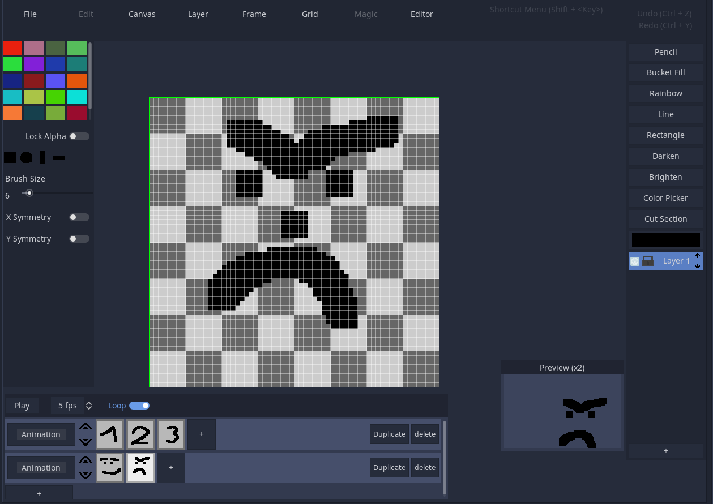
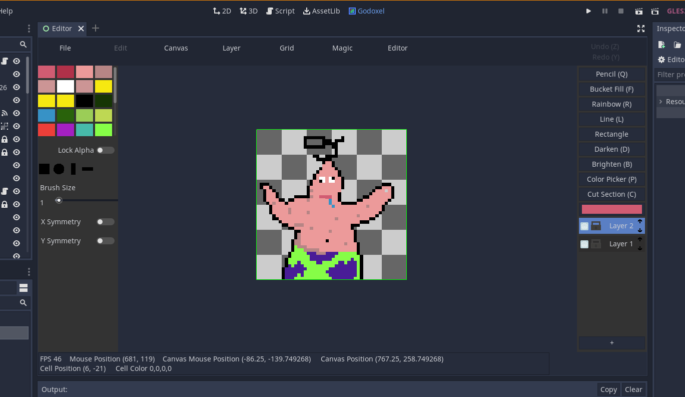
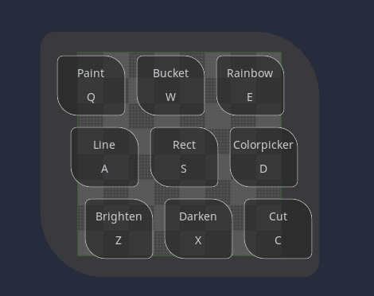

# Godoxel (image Editor) v0.4
###### (Godot-Pixel Image Editor)

A Plugin for Godot that allows you to create images in the editor.

# Features

* Animation-Panel (added in v0.4)
* Frames with previews (added in v0.4)
* Shortcut-Window with shift (added in v0.4)
* Preview Window (v0.3)
* Undo/Redo with Z/Y (now prints undo/redo message)
* Layers
* Save/Load (png)
* Multiple layers (can be (alpha)-locked/hidden)
* Tools: Pencil, lighten/darken, rectangle/line, fill, ...

---
# Screenshots

---
###### For feature proposals or occuring problems, please write an issue or message me on Discord cobrapitz#2872
